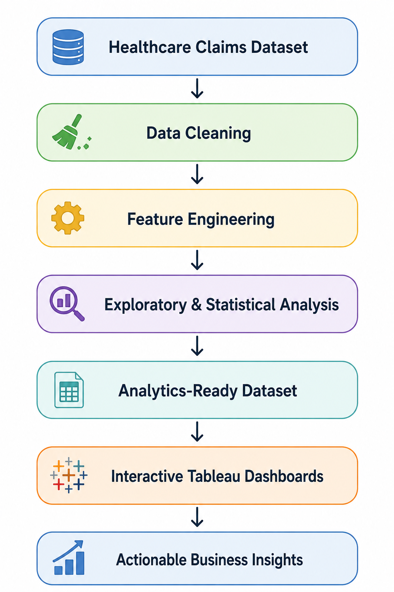
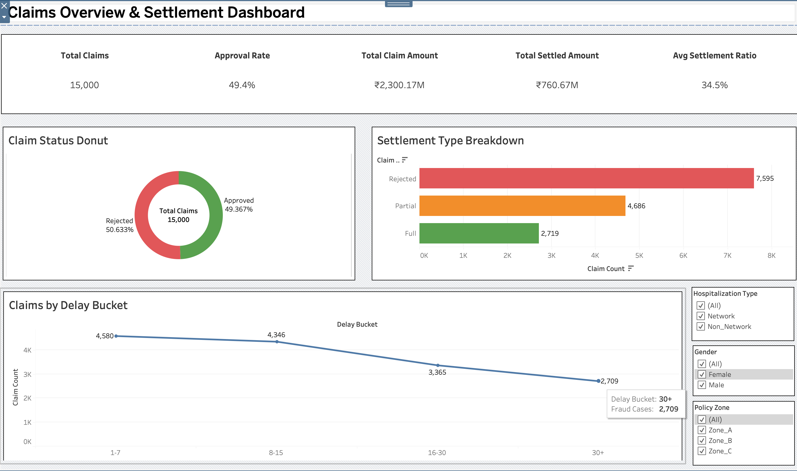
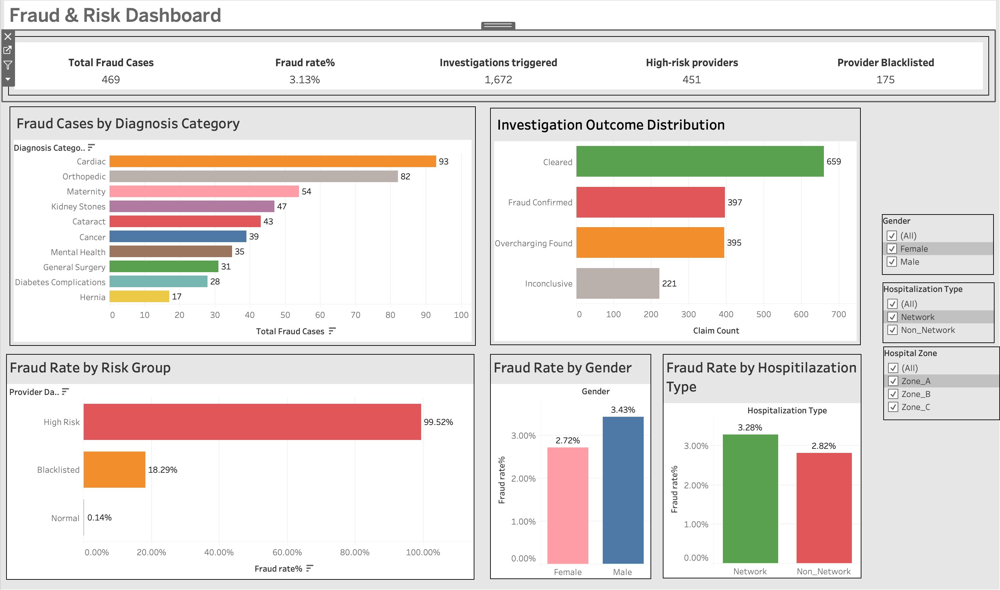
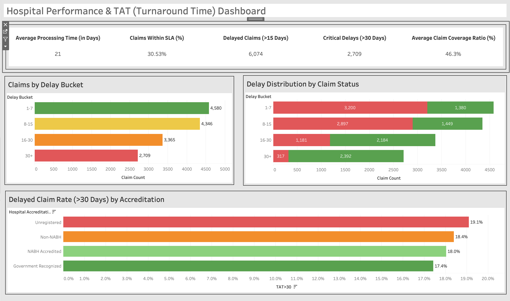
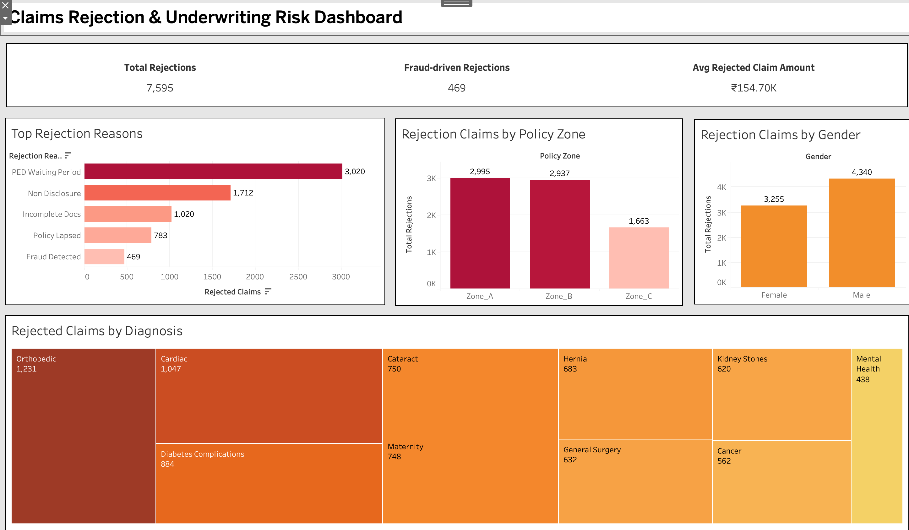

<p align="center">
  
</p>

<h1 align="center">🏥 Healthcare Claims Analytics</h1>

<h3 align="center">
End-to-End Healthcare Analytics using R • SQL • Tableau
</h3>

<p align="center">
Transforming raw healthcare claims data into actionable business intelligence through statistical analysis, interactive dashboards, and data-driven insights.
</p>

<p align="center">

<a href="https://public.tableau.com/app/profile/abhimanyu.mandal/viz/HealthcareClaimsAnalyticsStory/HealthcareClaimsAnalyticsStory">

</a>

<a href="LICENSE">

</a>

<a href="https://www.r-project.org/">

</a>

</p>

---

# 📌 Project Overview

Healthcare insurers process thousands of insurance claims every day. Understanding **claim approvals, fraud patterns, settlement timelines, rejection reasons, and provider performance** is essential for improving operational efficiency and reducing financial losses.

This project presents an **end-to-end healthcare claims analytics pipeline**, combining **R** for data preparation and statistical analysis with **Tableau** for interactive business intelligence dashboards.

---

# 📊 Project Highlights

| Metric | Value |
|---------|------:|
| 📄 Claims Analysed | **15,000+** |
| 💰 Total Claim Value | **₹2.3 Billion** |
| ✅ Claim Approval Rate | **49.4%** |
| 🚨 Potential Fraud Cases | **3.1%** |
| ⏱ SLA Compliance | **30.5%** |

---

# 🎯 Business Objectives

This project answers key healthcare business questions:

- Which factors influence claim approval?
- What are the leading causes of claim rejection?
- Which hospitals demonstrate the best performance?
- Can potential fraud patterns be identified?
- How efficiently are claims processed?
- What trends exist across claim types and providers?

---

# ⚙️ Workflow

<p align="center">

</p>

```
Raw Claims Data
        │
        ▼
Data Cleaning (R)
        │
        ▼
Feature Engineering
        │
        ▼
Exploratory Data Analysis
        │
        ▼
Statistical Analysis
        │
        ▼
Processed Dataset
        │
        ▼
Interactive Tableau Dashboards
        │
        ▼
Business Insights
```

---

# 🛠 Tech Stack

| Category | Tools |
|-----------|-------|
| Programming | R |
| Database | SQL |
| Data Wrangling | dplyr, tidyr, tidyverse |
| Visualization | Tableau, ggplot2 |
| Analytics | Statistical Analysis, Exploratory Data Analysis |
| Domain | Healthcare Analytics, Business Intelligence |

---

# 📂 Repository Structure

```
healthcare-claims-analytics/

├── assets/
│   ├── banner.png
│   ├── workflow.png
│   ├── dashboard-overview.png
│   ├── dashboard-claims.png
│   ├── dashboard-rejection.png
│   ├── dashboard-fraud.png
│   └── dashboard-provider.png
│
├── data/
│   ├── raw/
│   └── processed/
│
├── scripts/
│   ├── 01_data_cleaning.R
│   ├── 02_feature_engineering.R
│   ├── 03_exploratory_analysis.R
│   ├── 04_statistical_analysis.R
│   └── 05_export_for_tableau.R
│
├── tableau/
│   └── Healthcare_Claims_Analytics.twbx
│
├── outputs/
│   ├── figures/
│   └── tables/
│
└── README.md
```

---

# 📈 Dashboard Gallery

## 📊 Executive Overview

<p align="center">

</p>

Provides a high-level summary of claims, settlement trends, approval rates, and key performance indicators.

---

## 💰 Claims & Settlement Analysis

<p align="center">

</p>

Analyzes claim values, settlement efficiency, approval rates, and claim distributions.

---

## 🚨 Fraud & Risk Intelligence

<p align="center">

</p>

Highlights suspicious claim patterns, fraud indicators, and high-risk providers.

---

## 🏥 Hospital Performance

<p align="center">

</p>

Compares hospitals using approval rates, claim volumes, and operational performance.

---

## ❌ Claim Rejection Analysis

<p align="center">

</p>

Identifies the leading rejection reasons and opportunities to reduce claim denial rates.

---

# 🔍 Key Insights

- ✅ Analysed more than **15,000 healthcare insurance claims**.
- 📈 Built an interactive Tableau dashboard for business users.
- 🚨 Identified **3.1% potential fraudulent claims**.
- ⏱ Found that only **30.5%** of claims were processed within SLA.
- 📉 Highlighted major claim rejection reasons including documentation issues and waiting-period policies.
- 🏥 Compared provider performance across hospitals to identify operational strengths and weaknesses.

---

# 🚀 Getting Started

Clone the repository

```bash
git clone https://github.com/AbhimanyuMandal/healthcare-claims-analytics.git
```

Open the R scripts in RStudio.

Run the scripts sequentially:

```
01_data_cleaning.R

↓

02_feature_engineering.R

↓

03_exploratory_analysis.R

↓

04_statistical_analysis.R

↓

05_export_for_tableau.R
```

Finally, open the Tableau workbook inside the `tableau` folder.

---

# 📌 Future Improvements

- Develop machine learning models to predict claim approval.
- Implement anomaly detection for fraud identification.
- Add time-series forecasting of healthcare claims.
- Deploy dashboards using Tableau Cloud.
- Build a Shiny application for interactive exploration.

---

# 📚 Dataset

This project uses a publicly available healthcare insurance claims dataset for educational and analytical purposes.

---

# 🤝 Connect With Me

**Abhimanyu Mandal**

🌐 Portfolio  
https://abhimanyumandal.github.io/Personal-Portfolio/#

💼 LinkedIn  
https://www.linkedin.com/in/abhimanyu-mandal/

📧 Email  
abhimanyumandal0810@gmail.com

---

<p align="center">

⭐ If you found this project useful, consider giving it a star!

</p>
